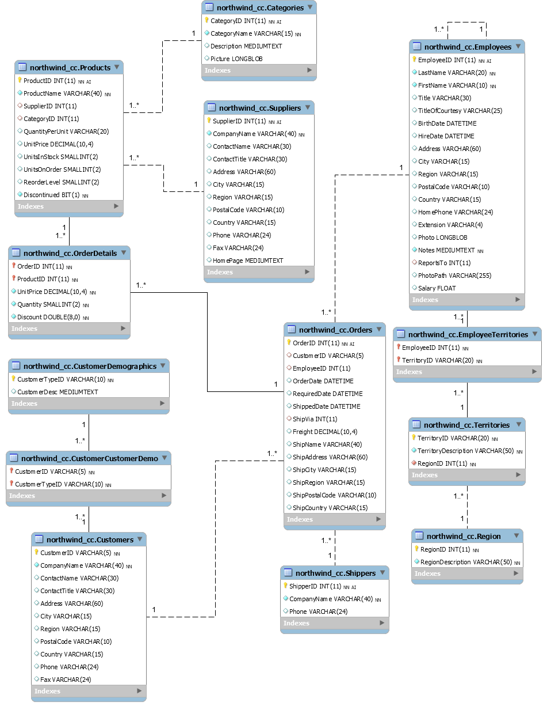

# Task description

---------------

---------------

## Setup sample DB

There is a given database schema named Northwind. You can read an article which explains it here:  
https://theaccessbuddy.wordpress.com/2011/07/03/northwind-database-explained/  
You can find the relational model and the creational scripts below. Before you start to work on the weekly exercises please run these scripts on your machine to create the DB what you will work with.  
Connect to your localhost db as an admin  
Execute [01_Northwind.MySQL5_create_database.sql](description/01_Northwind.MySQL5_create_database.sql)  
Execute [02_Northwind.MySQL5.sql](description/02_Northwind.MySQL5.sql)  
Execute [03_Northwind_users_creation_and_grant_access.sql](description/03_Northwind_users_creation_and_grant_access.sql)  
After this please tries to explore a DB structure and the data it contains. What kind of relationship are between the different tables. On this DB you can practice and repeat the basic SQL queries what you learnt. In the afternoon it will help us to summerize what you learnt about the SQL so far.

-----------

tags: [DBMS](https://en.wikipedia.org/wiki/Database) [SQL](https://en.wikipedia.org/wiki/SQL)

------------------

------------------

## ORM

Your task is to do the followings:  
We would like to represent the database content as objects in an object oriented language like the python. [Object-relational mapping](https://en.wikipedia.org/wiki/Object-relational_mapping) (ORM) is a technique (a.k.a. design pattern) of accessing a relational database from an object-oriented language (Java, python for example).  
Application:  
GitHub repository is needed.  
Test are not mandatory.  
Create a python application which can import data from a CSV file, parses the containing data to objects and stores the data in MySQL database. The application has to be able to export data from database to CSV file. The application uses the previusly created NorthwindDB. Import and export functions are limited to use these tables: Employees, Customers, Orders and OrderDetails so you don't need to create a class for every tables in the DB !  
All of the classes should contain a static parse() method which require a string as a parameter (CSV row) and creates (and returns) an object from it.  
The classes should contain a persist() method (procedure) with no parameter.  
Define a to_csv() method which returns a string representation of the current object which can be written out as a CSV row.  
OPTIONAL: Define a function (in every class), called select(), which generates and runs a basic SQL select operation. The method gets a string parameter where you can define which field you want to be selected, a named boolean parameter, called distinct (default False) which means if the selected field should be distinct and a named string parameter where, which means if you want your result to be filtered with the given conditions.  
OPTIONAL: Create a basic menu where user can use the features above.  
E.g.  
Import from CSV : Sub-menu > Employees, Customers, Orders, Orders and details  
Export to CSV : Sub-menu > Employees, Customers, Orders, Orders and details  
List table : Sub-menu > Employees, Customers, Orders, Orders and details  

--------

Attachments:  
[customers.csv](description/customers.csv)  
[employees.csv](description/employees.csv)  
[order_details.csv](description/order_details.csv)  
[orders.csv](description/orders.csv)  

--------

Tags: [DBMS](https://en.wikipedia.org/wiki/Database) [OOP](https://en.wikipedia.org/wiki/Object-oriented_programming) [*python*](https://en.wikipedia.org/wiki/Python_(programming_language)) [SQL](https://en.wikipedia.org/wiki/SQL)
